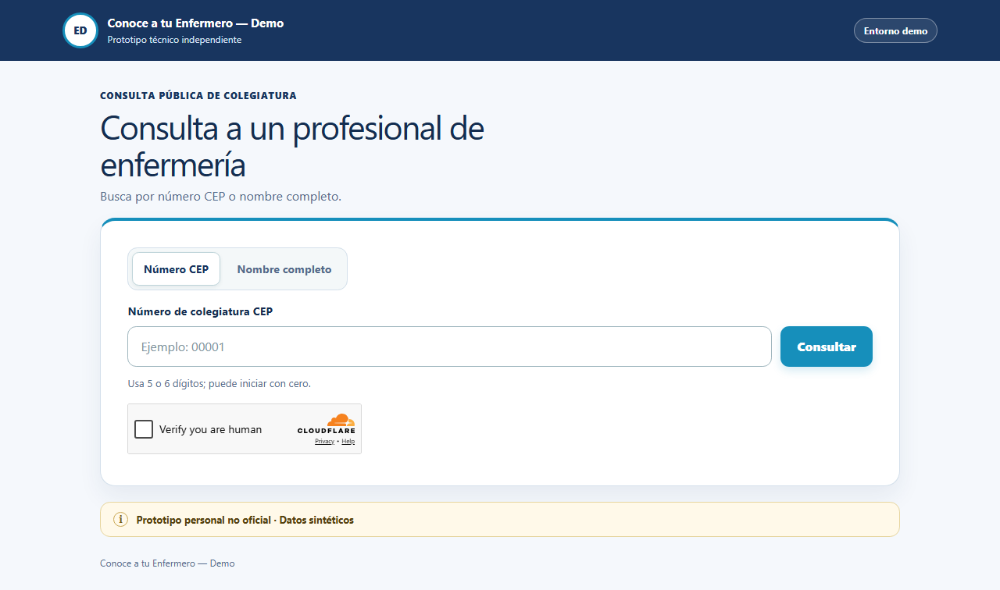
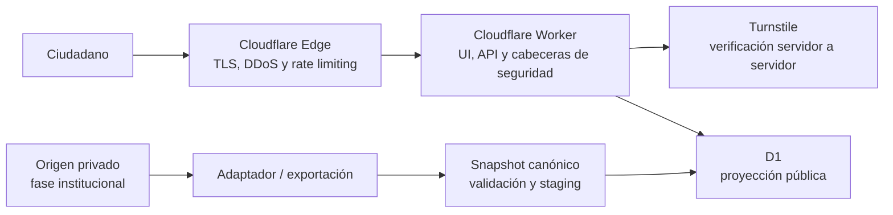
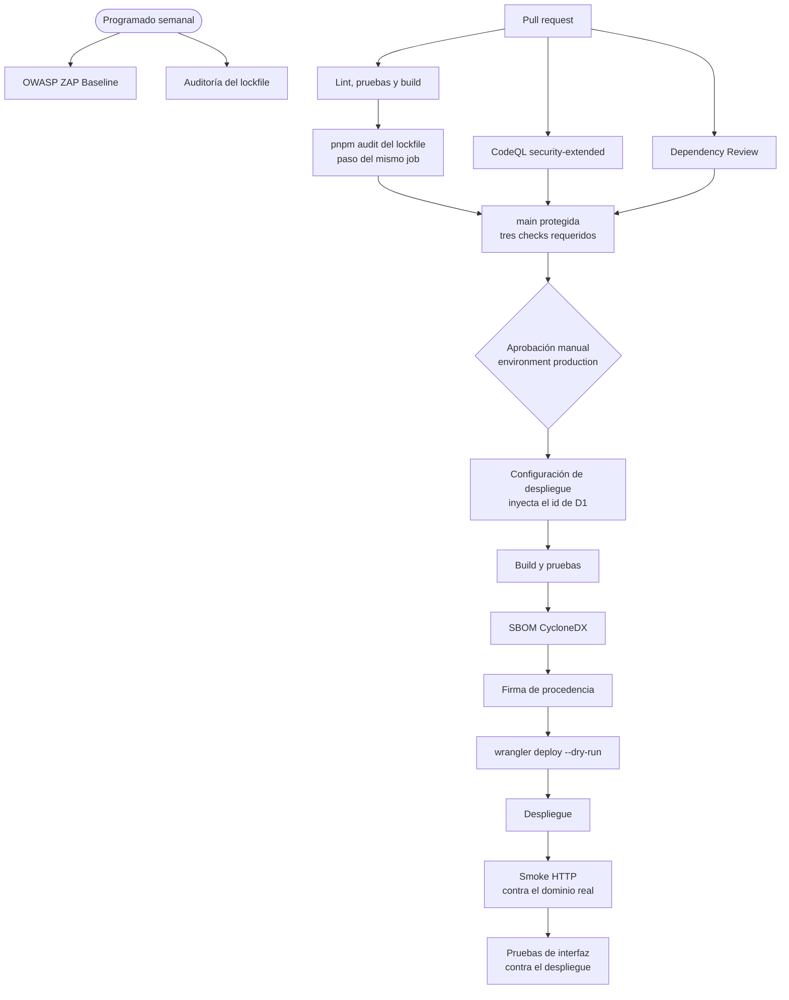

<div align="center">

# Conoce a tu Enfermera(o)

**Validador público de colegiatura y habilidad, serverless, seguro y de bajo mantenimiento.**

Prototipo para sustituir el validador `/validar/` del Colegio de Enfermeros del Perú (CEP)

[](https://enfermeros-demo.yersongallardo.com/)
[](https://github.com/ygallardops/conoce-tu-enfermero-demo/actions/workflows/devsecops.yml)
[](https://github.com/ygallardops/conoce-tu-enfermero-demo/actions/workflows/deploy.yml)
[](https://github.com/ygallardops/conoce-tu-enfermero-demo/actions/workflows/dast.yml)
[](LICENSE)

[](https://developers.cloudflare.com/workers/)
[](https://react.dev/)
[](https://www.typescriptlang.org/)
[](https://www.terraform.io/)

[**Abrir la demo**](https://enfermeros-demo.yersongallardo.com/) · [Contrato OpenAPI](openapi/consulta-api.yaml) · [Política de seguridad](SECURITY.md) · [Mantenimiento de seguridad](SECURITY-MAINTENANCE.md)

<br>

[](https://enfermeros-demo.yersongallardo.com/)

</div>

> [!IMPORTANT]
> **Demo personal no oficial.** La aplicación y su línea base de seguridad están desplegadas. Todos los nombres, fotografías y registros son sintéticos; el servicio no consulta el padrón real ni emite verificaciones oficiales.

> [!TIP]
> Para probar la demo puede utilizar el número CEP sintético `00001`.

## Contenido

- [Qué resuelve](#qué-resuelve)
- [Arquitectura](#arquitectura)
- [Inicio rápido](#inicio-rápido)
- [Seguridad implementada](#seguridad-implementada)
- [DevSecOps](#devsecops)
- [Infraestructura y despliegue](#infraestructura-y-despliegue)
- [Configuración](#configuración)
- [Estado y próximos pasos](#estado-y-próximos-pasos)
- [Alcance y uso de marca](#alcance-y-uso-de-marca)
- [Contratos públicos](#contratos-públicos)
- [Contribuir](#contribuir)
- [Licencia](#licencia)

## Qué resuelve

El proyecto demuestra una arquitectura Lean de bajo mantenimiento, aislamiento de datos y DevSecOps para una entidad con equipo técnico y presupuesto reducidos.

| Capacidad | Detalle |
| --- | --- |
| **Consulta sin fricción** | Pública, sin registro, login, DNI, RENIEC/PIDE ni creación de una base de datos de consultantes. |
| **Búsqueda exacta** | Por número CEP de 5 o 6 dígitos —incluidos ceros iniciales— o por nombre completo normalizado. |
| **Respuesta mínima** | Hasta cinco coincidencias con número CEP, nombre, consejo regional, habilidad, fecha de actualización y fotografía pública opcional. |
| **Datos aislados** | Proyección pública D1 separada del padrón maestro; la aplicación nunca se conecta directamente al sistema institucional. |
| **Ingesta portable** | Adaptadores demostrativos para JSON, CSV y API/NDJSON que producen el mismo snapshot canónico verificable. |
| **Anti-scraping** | Controles anti-enumeración sin Redis ni infraestructura permanente. |

## Arquitectura



La actualización prevista es unidireccional: origen privado → exportación mínima → validación → staging → activación atómica. Si la carga falla, el snapshot público anterior permanece activo. El origen real y sus credenciales quedan fuera de la aplicación pública.

## Inicio rápido

Requisitos: Node.js `22.13` o superior y Corepack disponible.

```bash
git clone https://github.com/ygallardops/conoce-tu-enfermero-demo.git
cd conoce-tu-enfermero-demo/app
corepack enable
corepack prepare pnpm@11.16.0 --activate
pnpm install --frozen-lockfile
pnpm run data:demo
pnpm run data:verify
pnpm run data:import:check
pnpm run data:local:init
pnpm run lint
pnpm run test
pnpm run dev
```

| Script | Qué hace |
| --- | --- |
| `data:demo` / `data:verify` | Genera el snapshot sintético y lo verifica contra el contrato. |
| `data:import:check` | Valida el plan de ingesta sin red ni credenciales. |
| `data:local:init` | Carga exclusivamente el snapshot sintético en D1 local. |
| `test` | Compila la aplicación y ejecuta las pruebas automatizadas. |

## Seguridad implementada

Turnstile fail-closed, consultas exactas con SQL preparado, rate limiting en el borde, CSP con nonce y publicación atómica del padrón. Ningún log contiene búsquedas ni tokens.

<details>
<summary><b>Ver todos los controles</b></summary>

<br>

- Turnstile obligatorio y fail-closed, con validación servidor a servidor de token, hostname y acción, además de timeout controlado.
- Consultas exactas, sin comodines, listados, paginación ni exportación; máximo cinco resultados.
- SQL preparado, JSON de esquema cerrado y límites explícitos de cuerpo, campos y longitudes.
- Rate limiting de Cloudflare Free en la API pública: 5 solicitudes por 10 segundos por IP y bloqueo temporal al exceder el umbral.
- CSP con nonce, HSTS, `nosniff`, políticas de permisos y referencias, protección de iframe y respuestas HTML/JSON con `no-store`. El endpoint de optimización de imágenes conserva la suya propia, más estrecha, en lugar de recibir la general.
- TLS 1.2 como mínimo, redirección a HTTPS en el borde y validación del certificado de origen (`ssl` en `strict`), los tres declarados en Terraform.
- `x-request-id` para soporte sin registrar el término buscado ni el token de Turnstile.
- Publicación del padrón desde `staging` con versión, checksum e invariantes D1, seguida de activación atómica. La ingesta comprueba que la base tenga esas invariantes antes de inspeccionar o escribir, y se detiene nombrando la que falte.
- Observabilidad nativa de Workers sin logs de aplicación que contengan búsquedas o tokens.

Las reglas WAF administradas no están habilitadas porque requieren un plan superior. R2 tampoco forma parte del despliegue actual. La línea base vigente no requirió crear recursos facturables.

El plan gratuito acota además lo que la regla de rate limiting puede expresar: el recuento es por IP y por centro de datos, no global, y la expresión no admite `Hostname` como campo, de modo que la regla alcanza la ruta de consulta en cualquier hostname de la zona. Ambas cosas están anotadas en [`infra/edge.tf`](infra/edge.tf) como límites del plan, no como decisiones de diseño.

</details>

## DevSecOps

Cada pull request pasa calidad, pruebas, SAST y revisión de dependencias antes de entrar en `main`; cada despliegue exige aprobación manual y termina verificando la demo publicada.

| Control | Ejecución | Comportamiento |
| --- | --- | --- |
| Datos, lint, pruebas y build | Push y pull request hacia `main` | Bloqueante |
| `pnpm audit` | Push y pull request | Revisa el lockfile completo y bloquea vulnerabilidades conocidas de severidad moderada o superior |
| Dependency Review | Pull request | Bloquea dependencias nuevas de severidad alta o crítica |
| CodeQL `security-extended` | Push y pull request | Ejecuta SAST; los hallazgos nuevos se revisan antes de integrar |
| Dependabot | Semanal | Propone actualizaciones de npm y GitHub Actions |
| OWASP ZAP Baseline + smoke HTTP | Semanal y manual | Bloquea alertas no aceptadas y verifica cabeceras/contrato de rutas críticas |
| Auditoría del lockfile programada | Semanal | Detecta avisos publicados con `main` en reposo, sin depender de que haya pull requests abiertas |
| Despliegue | Push a `main` que toque `app/` | Exige aprobación manual y verifica la demo publicada |

<details>
<summary><b>Ver el flujo completo del pipeline</b></summary>

<br>



La rama `main` está protegida. Los cambios se integran mediante pull request y se someten a controles de calidad y seguridad. Las Actions externas se fijan a commits inmutables y Dependabot conserva comentarios de versión para proponer su renovación.

Los controles de seguridad se verifican por comportamiento y no por inspección del código. La validación de Turnstile en servidor, por ejemplo, se ejerce con un `fetch` inyectado que cubre token rechazado, hostname distinto, acción distinta, error HTTP, red caída y cada variable de entorno ausente: una comparación invertida hace fallar la prueba. Vale la pena decirlo porque la alternativa —comprobar que ciertos identificadores aparecen en el fichero— pasa igual de verde y no protege de nada.

</details>

> [!NOTE]
> **La consulta que termina bien no la prueba ninguna automatización.** Turnstile no se resuelve de forma programática, de modo que el smoke verifica el rechazo de un token inválido y las pruebas de interfaz verifican que sin resolver el desafío no salga ninguna petición, pero el camino completo se comprueba a mano en el navegador después de cada despliegue.

El proyecto publica un [registro de mantenimiento de seguridad](SECURITY-MAINTENANCE.md) con fechas, alcance y evidencia de remediación, sin incluir payloads, secretos ni instrucciones de explotación.

## Infraestructura y despliegue

La configuración del borde se declara como código en [`infra/`](infra/) con Terraform, el código del Worker lo publica `wrangler` y el esquema de D1 lo gestionan las migraciones de Drizzle. Cada despliegue genera SBOM y firma de procedencia.

<details>
<summary><b>Ver el detalle de infraestructura y despliegue</b></summary>

<br>

**Terraform.** Declara el registro DNS de la demo, la ruta del Worker, el widget de Turnstile, los ajustes de zona y la regla de rate limiting. Un cambio hecho desde el panel de Cloudflare aparece como diferencia en el siguiente `terraform plan`, de modo que la configuración deja de ser un estado invisible.

La regla de rate limiting es un caso aparte y conviene decirlo con precisión: el token de Terraform la lee pero no puede escribirla, así que Terraform **detecta** su deriva y no la corrige. Modificarla exige el panel. El permiso no se amplía porque, con plan gratuito, apenas hay nada que cambiar en ella.

Los recursos existentes se incorporaron mediante importación, sin recrearlos. El estado vive en un backend remoto con bloqueo y nunca en el repositorio: `terraform.tfstate` guarda en claro todo valor que Terraform lee.

**Reparto de responsabilidades.** Es estricto. Terraform no gestiona el Worker ni el esquema de la base: el código y sus bindings son de `wrangler` y las migraciones de Drizzle. Un recurso declarado en `wrangler.jsonc` no se declara en `infra/`.

**Cadena de suministro.** Cada despliegue genera un SBOM en formato CycloneDX y firma la procedencia del bundle publicado, de modo que se puede verificar criptográficamente que salió de este repositorio, de un commit concreto y de este workflow. La verificación se hace con `gh attestation verify`.

**Despliegue.** Se ejecuta desde GitHub Actions contra un environment protegido que exige aprobación manual. Cada ejecución construye, pasa las pruebas, ensaya el despliegue en seco, publica y verifica la demo con un smoke HTTP contra el dominio real, dejando registro del commit y de la versión desplegada. Las credenciales son un token de mínimo privilegio guardado en el environment, no en el repositorio.

Ese token solo puede publicar código del Worker: no tiene permiso sobre D1. Por eso las migraciones de la base **no** las aplica el pipeline, sino el operador antes de integrar el cambio que las necesita. Dárselo convertiría una credencial que solo sustituye código en otra capaz de reescribir el padrón, y se prefiere la credencial mínima.

**Identificadores fuera del repositorio.** `app/wrangler.jsonc` no versiona el identificador de la base D1: el repositorio es público y un identificador de cuenta no tiene por qué estar en él, el mismo criterio que se aplica a `account_id` y `zone_id`. El paso `deploy:config` lo inyecta desde `CLOUDFLARE_D1_DATABASE_ID` en un fichero ignorado por Git, y falla de forma explícita si la variable no existe o no es un UUID. El ensayo en seco y el despliegue usan esa misma configuración, de modo que el ensayo prueba exactamente lo que se publica.

</details>

## Configuración

El ejemplo local está en [`app/.env.example`](app/.env.example). No copie secretos reales a archivos versionados.

<details>
<summary><b>Ver variables y secretos</b></summary>

<br>

| Variable o secreto | Dónde vive | Uso |
| --- | --- | --- |
| `PUBLIC_BRAND_PROFILE` | Build | Perfil visual público: `demo` es el valor seguro predeterminado. |
| `PUBLIC_TURNSTILE_SITE_KEY` | Build | Clave pública del widget Turnstile. |
| `TURNSTILE_SECRET_KEY` | `wrangler secret` | Secreto del Worker para validar Turnstile; nunca se guarda en Git. |
| `TURNSTILE_EXPECTED_HOSTNAME` | `wrangler.jsonc` | Host público exacto que debe acreditar Siteverify. |
| `TURNSTILE_EXPECTED_ACTION` | `wrangler.jsonc` | Acción exacta esperada para la consulta pública. |
| `ALLOWED_FRAME_ANCESTORS` | `wrangler.jsonc` | Lista opcional de orígenes HTTPS autorizados para iframe; sin valor, se deniega la incrustación. |
| `DEMO_BASE_URL` | Variable de Actions | Variable de GitHub Actions para cambiar el destino del DAST. |
| `CLOUDFLARE_API_TOKEN` | Entorno local o environment | Secreto de privilegio mínimo usado únicamente por el CLI de ingesta remota. |
| `CLOUDFLARE_ACCOUNT_ID` | Entorno local o environment | Cuenta destino para una ingesta explícitamente autorizada. |
| `CLOUDFLARE_D1_DATABASE_ID` | Entorno local y variable del environment `production` | Base D1 destino de la ingesta, y origen del identificador que `deploy:config` inyecta al desplegar. No es un secreto, pero tampoco se versiona: `wrangler.jsonc` no lo contiene. |
| `PADRON_ALLOWED_PHOTO_HOSTS` | Entorno local | Hosts HTTPS aprobados para fotografías externas, separados por comas. Vacía por defecto: sin ella solo se admiten rutas propias del dominio. |

</details>

> [!WARNING]
> La ingesta remota permanece desactivada por defecto. El CLI solo escribe cuando recibe `--apply`, la confirmación exacta de `dataset_version` y las tres variables Cloudflare; el modo normal es un `dry-run` local. No ejecute `--apply` contra la demo sin una autorización operativa explícita.

Dos controles adicionales protegen el padrón publicado. Un snapshot sin registros se rechaza siempre, porque publicar un padrón vacío nunca es una actualización y dejaría la consulta devolviendo «no encontrado» sin señal de error. Y una variación de más del 10 % en el número de registros respecto al activo detiene la ingesta antes de escribir nada e indica la cifra exacta: continuar exige repetir la operación con `--confirm-variation` transcribiendo esa cifra, de modo que una exportación truncada no llegue a producción sin que alguien la haya mirado.

## Estado y próximos pasos

- [x] **Implementado:** contratos ejecutables, esquema D1, datos sintéticos y adaptadores equivalentes.
- [x] **Desplegado:** consulta accesible, D1, Turnstile y metadatos para vistas previas sociales.
- [x] **Operativo:** cabeceras defensivas, publicación atómica, rate limiting, observabilidad, DAST bloqueante y protección de `main`.
- [x] **Plataforma:** configuración del borde declarada en Terraform, despliegue continuo con aprobación manual, SBOM y firma de procedencia en cada publicación.
- [ ] **Próximo paso institucional:** adaptar el origen real, validar el catálogo oficial y preparar la sustitución controlada de `/validar/` cuando el CEP proporcione la información y autorizaciones necesarias.

## Alcance y uso de marca

El MVP reemplaza únicamente el validador legado `/validar/`; no reconstruye WordPress. No incorpora RENIEC/PIDE, cuentas, OTP, correo, pagos, cálculo de deuda, constancias firmadas, descargas masivas, Redis, Keycloak, Kubernetes ni microservicios.

La identidad visual es propia y está inspirada en servicios públicos digitales. Existe un perfil declarativo `cep-preview` para pruebas visuales autorizadas, pero `demo` es siempre el valor predeterminado y seguro. El repositorio no distribuye logotipos oficiales ni afirma representar al CEP.

## Contratos públicos

- [Contrato OpenAPI de consulta](openapi/consulta-api.yaml)
- [JSON Schema del snapshot](contracts/padron-snapshot.schema.json)
- [Política de seguridad](SECURITY.md)

## Contribuir

Es una demostración técnica personal y no acepta contribuciones de código externas. Los errores de documentación se reportan con un issue y las vulnerabilidades, en privado, según [`SECURITY.md`](SECURITY.md). El detalle está en [`CONTRIBUTING.md`](CONTRIBUTING.md).

## Licencia

El código publicado se distribuye bajo la [licencia MIT](LICENSE). La licencia no concede derechos sobre nombres, logotipos o marcas de terceros.
