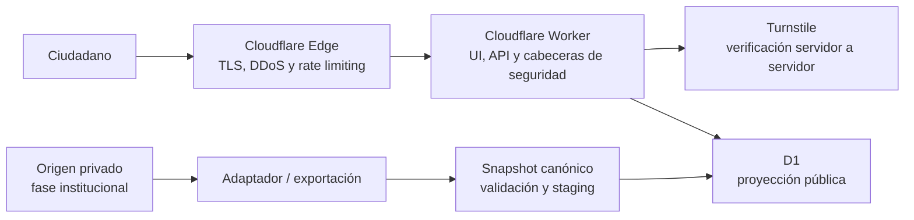

# Conoce a tu Enfermera(o)

[](https://github.com/ygallardops/conoce-tu-enfermero-demo/actions/workflows/devsecops.yml)
[](https://github.com/ygallardops/conoce-tu-enfermero-demo/actions/workflows/dast.yml)
[](LICENSE)

Prototipo serverless y seguro para sustituir el validador público de colegiatura y habilidad del Colegio de Enfermeros del Perú (CEP). El proyecto demuestra una arquitectura Lean de bajo mantenimiento, aislamiento de datos y DevSecOps para una entidad con equipo técnico y presupuesto reducidos.

> **Demo personal no oficial.** La aplicación y su línea base de seguridad están desplegadas. Todos los nombres, fotografías y registros son sintéticos; el servicio no consulta el padrón real ni emite verificaciones oficiales.

- [Abrir la demostración](https://enfermeros-demo.yersongallardo.com/)
- [Consultar el contrato OpenAPI](openapi/consulta-api.yaml)
- [Revisar la política de seguridad](SECURITY.md)

## Qué resuelve

- Consulta pública sin registro, login, DNI, RENIEC/PIDE ni creación de una base de datos de consultantes.
- Búsqueda exacta por número CEP de 5 o 6 dígitos —incluidos ceros iniciales— o por nombre completo normalizado.
- Respuestas de hasta cinco coincidencias con número CEP, nombre, consejo regional, habilidad, fecha de actualización y fotografía pública opcional.
- Proyección pública D1 aislada del padrón maestro; la aplicación nunca se conecta directamente al sistema institucional.
- Adaptadores demostrativos para JSON, CSV y API/NDJSON que producen el mismo snapshot canónico verificable.
- Controles anti-enumeración y anti-scraping sin Redis ni infraestructura permanente.

Para probar la demo puede utilizar el número CEP sintético `00001`.

## Arquitectura



La actualización prevista es unidireccional: origen privado → exportación mínima → validación → staging → activación atómica. Si la carga falla, el snapshot público anterior permanece activo. El origen real y sus credenciales quedan fuera de la aplicación pública.

## Seguridad implementada

- Turnstile obligatorio en la demo pública, con verificación en el servidor y renovación del token después de cada intento.
- Consultas exactas, sin comodines, listados, paginación ni exportación; máximo cinco resultados.
- SQL preparado, validación estricta de entrada y respuestas sin detalles internos.
- Rate limiting de Cloudflare Free en la API pública: 5 solicitudes por 10 segundos por IP y bloqueo temporal al exceder el umbral.
- CSP con nonce, HSTS, `nosniff`, políticas de permisos y referencias, protección de iframe y respuestas HTML/JSON con `no-store`.
- `x-request-id` para soporte sin registrar el término buscado ni el token de Turnstile.
- Publicación del padrón desde `staging` con versión y checksum, seguida de activación atómica.
- Observabilidad nativa de Workers sin logs de aplicación que contengan búsquedas o tokens.

Las reglas WAF administradas no están habilitadas porque requieren un plan superior. R2 tampoco forma parte del despliegue actual. La línea base vigente no requirió crear recursos facturables.

## Stack

- Cloudflare Workers, D1, Turnstile y rate limiting de borde.
- TypeScript, React 19, vinext, Drizzle ORM y SQLite/D1.
- Node.js 22 y pnpm fijado mediante Corepack.
- GitHub Actions, CodeQL, Dependency Review, Dependabot, secret scanning y OWASP ZAP.

## DevSecOps

| Control | Ejecución | Comportamiento |
| --- | --- | --- |
| Datos, lint, pruebas y build | Push y pull request hacia `main` | Bloqueante |
| `pnpm audit` | Push y pull request | Bloquea vulnerabilidades altas/críticas conocidas en producción |
| Dependency Review | Pull request | Bloquea dependencias nuevas de severidad alta o crítica |
| CodeQL `security-extended` | Push y pull request | Ejecuta SAST; los hallazgos nuevos se revisan antes de integrar |
| Dependabot | Semanal | Propone actualizaciones de npm y GitHub Actions |
| OWASP ZAP Baseline | Semanal y manual | Bloquea cualquier alerta no aceptada en `.zap/rules.tsv` |

La rama `main` está protegida. Los cambios se integran mediante pull request y se someten a controles de calidad y seguridad.

## Ejecución local

Requisitos: Node.js `22.13` o superior y Corepack disponible.

```bash
git clone https://github.com/ygallardops/conoce-tu-enfermero-demo.git
cd conoce-tu-enfermero-demo/app
corepack enable
corepack prepare pnpm@11.16.0 --activate
pnpm install --frozen-lockfile
pnpm run data:demo
pnpm run data:verify
pnpm run data:import:check
pnpm run data:local:init
pnpm run lint
pnpm run test
pnpm run dev
```

`data:import:check` valida el plan de ingesta sin red ni credenciales. `data:local:init` carga exclusivamente el snapshot sintético en D1 local. `pnpm run test` compila la aplicación y ejecuta las pruebas automatizadas.

## Configuración

| Variable o secreto | Uso |
| --- | --- |
| `PUBLIC_BRAND_PROFILE` | Perfil visual público: `demo` es el valor seguro predeterminado. |
| `PUBLIC_TURNSTILE_SITE_KEY` | Clave pública del widget Turnstile. |
| `TURNSTILE_SECRET_KEY` | Secreto del Worker para validar Turnstile; nunca se guarda en Git. |
| `ALLOWED_FRAME_ANCESTORS` | Lista opcional de orígenes HTTPS autorizados para iframe; sin valor, se deniega la incrustación. |
| `DEMO_BASE_URL` | Variable de GitHub Actions para cambiar el destino del DAST. |
| `CLOUDFLARE_API_TOKEN` | Secreto de privilegio mínimo usado únicamente por el CLI de ingesta remota. |
| `CLOUDFLARE_ACCOUNT_ID` | Cuenta destino para una ingesta explícitamente autorizada. |
| `CLOUDFLARE_D1_DATABASE_ID` | Base D1 destino para una ingesta explícitamente autorizada. |

El ejemplo local está en [`app/.env.example`](app/.env.example). No copie secretos reales a archivos versionados.

La ingesta remota permanece desactivada por defecto. El CLI solo escribe cuando recibe `--apply`, la confirmación exacta de `dataset_version` y las tres variables Cloudflare; el modo normal es un `dry-run` local. No ejecute `--apply` contra la demo sin una autorización operativa explícita.

## Estado y próximos pasos

- Implementado: contratos ejecutables, esquema D1, datos sintéticos y adaptadores equivalentes.
- Desplegado: consulta accesible, D1, Turnstile y metadatos para vistas previas sociales.
- Operativo: cabeceras defensivas, publicación atómica, rate limiting, observabilidad, DAST bloqueante y protección de `main`.
- Próximo paso institucional: adaptar el origen real, validar el catálogo oficial y preparar la sustitución controlada de `/validar/` cuando el CEP proporcione la información y autorizaciones necesarias.

## Alcance y uso de marca

El MVP reemplaza únicamente el validador legado `/validar/`; no reconstruye WordPress. No incorpora RENIEC/PIDE, cuentas, OTP, correo, pagos, cálculo de deuda, constancias firmadas, descargas masivas, Redis, Keycloak, Kubernetes ni microservicios.

La identidad visual es propia y está inspirada en servicios públicos digitales. Existe un perfil declarativo `cep-preview` para pruebas visuales autorizadas, pero `demo` es siempre el valor predeterminado y seguro. El repositorio no distribuye logotipos oficiales ni afirma representar al CEP.

## Contratos públicos

- [Contrato OpenAPI de consulta](openapi/consulta-api.yaml)
- [JSON Schema del snapshot](contracts/padron-snapshot.schema.json)
- [Política de seguridad](SECURITY.md)

## Licencia

El código publicado se distribuye bajo la [licencia MIT](LICENSE). La licencia no concede derechos sobre nombres, logotipos o marcas de terceros.
